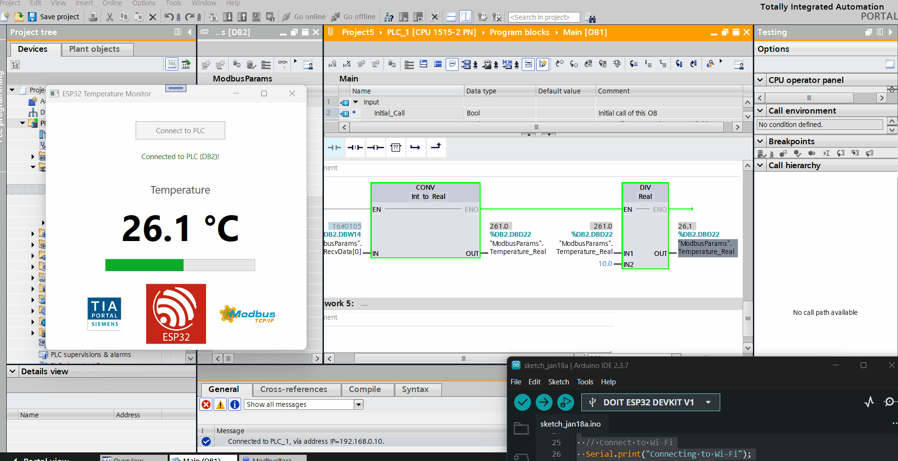

# 🌡️ IIoT Temperature Monitor: From ESP32 to Siemens PLC to C# WPF

This project demonstrates a full-stack Industrial IoT pipeline. It captures real-time temperature data from a physical sensor, transmits it to a Siemens S7-1500 PLC via Modbus TCP, and visualizes it on a custom Windows Desktop application.

## 🏗️ Architecture
**[ DHT11 Sensor ]** → *(OneWire)* → **[ ESP32 ]** → *(Modbus TCP/Wi-Fi)* → **[ S7-1500 PLC ]** → *(S7Comm)* → **[ C# WPF App ]**

## 🚀 Tech Stack
* **Embedded:** ESP32 (Arduino C++), DHT11 Sensor, Modbus Server.
* **Automation:** Siemens TIA Portal V16, S7-PLCSIM Advanced (Virtual Ethernet Adapter).
* **Software:** C# .NET Core (WPF), S7NetPlus Library.

## ⚙️ How it Works
1.  **The Edge:** The ESP32 reads the temperature (e.g., 23.8°C), scales it to an integer (`238`), and stores it in a Modbus Holding Register.
2.  **The Control:** The Siemens PLC acts as a Modbus Client. It polls the ESP32 every 500ms, receives the raw integer, and converts it back to a Real (Float) value in the Data Block.
3.  **The SCADA:** The C# WPF application connects to the PLC using the S7 protocol, reads the processed value from `DB2`, and updates the UI with a live progress bar and color-coded status.

### Live Dashboard

*Real-time visualization of temperature data.*

## 🔧 Hardware Required
* ESP32 Development Board (e.g., ESP32-WROOM)
* DHT11 or DHT22 Temperature Sensor
* PC with Ethernet Port & Wi-Fi
* USB Cable (for flashing ESP32)

## 💻 Software Required
* **Arduino IDE** (with ESP32 Board Manager installed)
* **Siemens TIA Portal V16** (or higher)
* **S7-PLCSIM Advanced V3.0** (Required for external TCP/IP communication)
* **Visual Studio 2019/2022** (with .NET Desktop Development workload)

## 📦 How to Run
1.  Flash the code in `/ESP32_Firmware` to your board.
2.  Load the Logic from `/PLC_Logic` into PLCSIM Advanced or a real S7-1500.
3.  Open the solution in `/WPF_Dashboard` with Visual Studio and hit Start.

---
*Created by Abdullah Khanzada*
https://www.linkedin.com/in/abdullahkhanzada/
